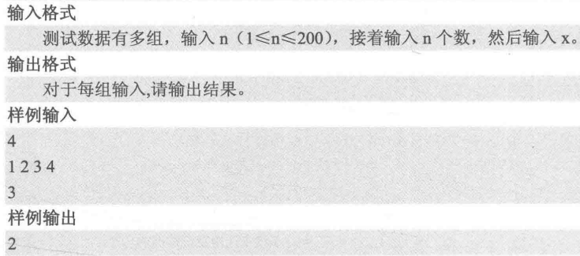
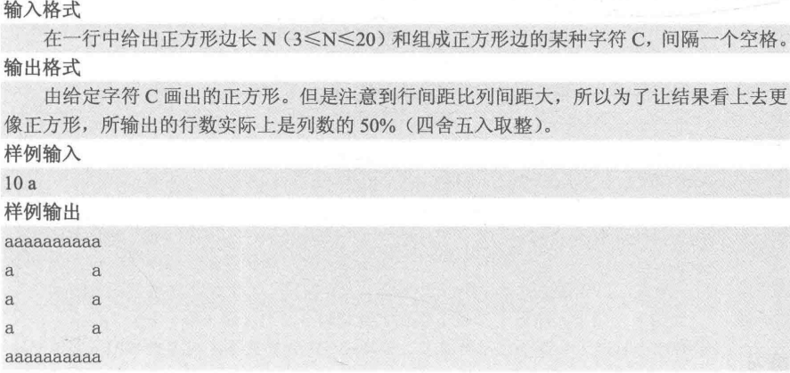
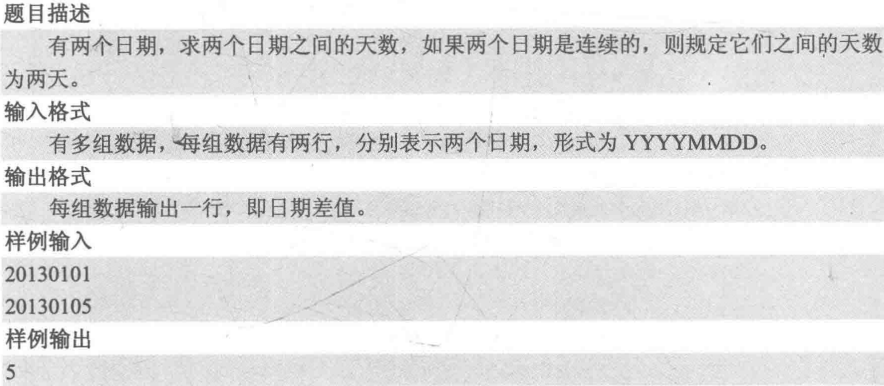
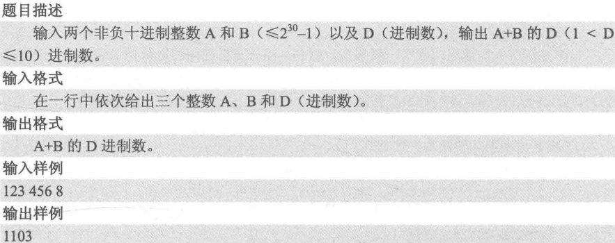
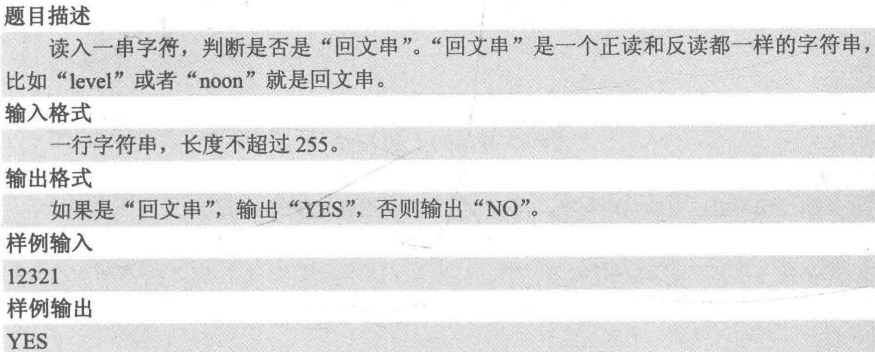
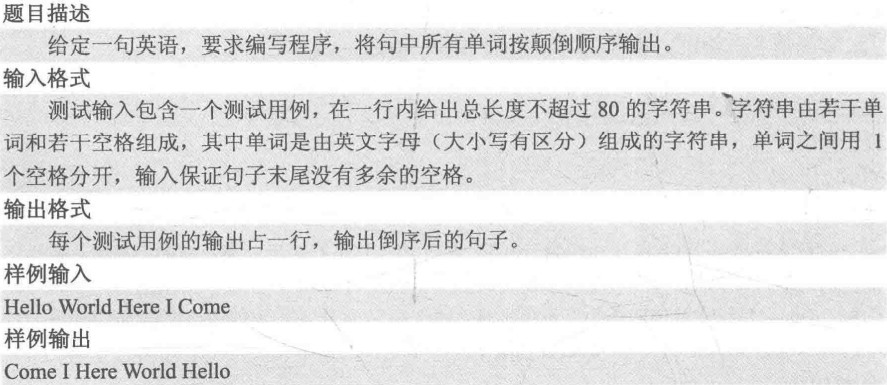

#cpp #Algorithm 2022/7/20
## 3.1 简单模拟
### PAT B1001 害死人不偿命的(3n+1)猜想
- 题目描述：对于任何一个自然数n，如果它是偶数，那么把砍掉一半；如果它是奇数，那么把(3n+1)砍掉一半。一直反复看下去，最后一定在某一步得到n=1。
- 输入格式：每个测试输入包含1个测试用例，即给出自然数n的值
- 输出格式：输出从n计算到1需要的步数
>输入样例：3
>输出样例：5

```cpp
#include <iostream>
using namespace std;
int main()
{
	int n, step=0;
	cin >> n;
	while(n != 1){
		if(n % 2 == 0)
			n /= 2;
		else
			n = (3*n + 1) / 2;
		++step;
	}
	cout << step << endl;
}
```
### PAT B1032 挖掘机技术哪家强
- 输入格式：在第一行给出不超过10^5的正整数N，即参赛人数。随后N行，每行给出一位参赛者的信息和成绩，包括其所代表的学校编号(从1开始连续编号)及其比赛成绩(百分制)，中间以空格分隔。
- 输出格式：在一行中给出得分最高的学校的编号及其总分，中间以空格分隔。题目保证答案唯一，没有并列。
```cpp
#include <iostream>
using namespace std;

const int maxn = 100010;
int a[maxn] = {0};//所有学校得分初始化为0

int main()
{
	int n, schID, score;
	cin >> n;
	
	for(int i=0; i<n; ++i){
		cin >> schID >> score;
		a[schID] += score;
	}
	
	int k=1, MAX = -1;
	for(int i=1; i<=n; ++i){
		if(a[i] > MAX){
			k = i;
			MAX = a[i];
		}
	}
	
	cout << k << " " << a[k] << endl;
	return 0;
}
```
## 3.2 查找元素
### codeup 1934 找x



```cpp
#include <iostream>
using namespace std;
const int maxn = 200;
int a[maxn] = {0};
int main()
{
	int n, x, k;
	cin >> n;	//输入n个数 
	for(int i=0; i<n; ++i){
		cin >> x;
		a[i] = x;
	}
	
	cin >> k;//输入要查找的数 
	int j; 
	for(j=0; j<n; ++j){
		if(a[j] == k){
			cout << j;
			break;
		}
	}
	
	//没找到则下标j==n 
	if(j == n)
		cout << -1;
	return 0;
}
```
## 3.3 图形输出
### PAT B1036 跟奥巴马一起编程
- 整数除以2进行四舍五入的操作可以通过判断它是否是奇数来解决，以避免浮点数的介入。



```cpp
#include <iostream>
using namespace std;
int main()
{
	int n;
	char c;
	scanf("%d %c", &n, &c);
	int row = (n % 2) ? (n/2 + 1) : (n / 2);
	//第1行 
	for(int i=0; i<n; ++i)
		printf("%c", c);
	printf("\n");
	//第2~row-2行 
	for(int i=0; i<row-2; ++i){
		printf("%c", c);
		for(int j=0; j<n-2; ++j){
			printf(" ");
			if(j==n-2)
				printf("\n");
		}
		printf("%c\n", c);
	}
	//第row行 
	for(int i=0; i<n; ++i)
		printf("%c", c);
	return 0;
}
```
## 3.4 日期处理
### codeup 1928 日期差值
- 思路：求日期之间相差天数的题目，可以令日期不断加1填，直到第一个日期等于第二个日期为止，即可统计出答案。
- 当加了一天后天数d等于当前月份m所拥有的天数加1，那么就令月份m加1、同时置天数d为1号；月份m变为13，就令年份加1、同时置月份m为1月。
- 为了方便直接提出每个月的天数，可以给定一个二维数组`int month[13][2]`，用来存放月的天数，其中二维为0时表述平年，为1时表示闰年。



```cpp
#include <iostream>
using namespace std;
int month[13][2] ={		//平年和闰年的每个月的天数 
	{0, 0}, {31, 31}, {28, 29}, {31, 31}, {30, 30}, {31, 31}, {30, 30},
	{31, 31}, {31, 31}, {30, 30}, {31, 31}, {30, 30}, {31, 31}
};

bool isLeap(int year){	//判断是否是闰年 
	return (year % 4 == 0 && year % 100 != 0) || (year % 400 == 0);
}

int main()
{
	int time1, y1, m1, d1;
	int time2, y2, m2, d2;
	while(scanf("%d%d", &time1, &time2) != EOF){
		if(time1 > time2){	//第一个日期晚于第二个日期，则交换 
			int tmp = time1;
			time1 = time2;
			time2 = tmp;
		}
		y1 = time1 / 10000, m1 = time1 % 10000 / 100, d1 = time1 % 100;
		y2 = time2 / 10000, m2 = time2 % 10000 / 100, d2 = time2 % 100;
		int ans = 1;	//记录结果
		//第一个日期没有达到第二个日期时进入循环
		while(y1 < y2 || m1 < m2 || d1 < d2){
			++d1;	//天数加1
			if(d1 == month[m1][isLeap(y1)] + 1){
				++m1;	//满月后，日期变为下个月的1号 
				d1 =1;
			}
			if(m1 == 13){
				++y1;//满年，日期变为下一年的1月 
				m1 = 1;
			}
			++ans;	//累计 
		}
		printf("%d\n", ans);	//输出结果 
	} 
	return 0;
}
```
## 3.5 进制转换
对于一个P进制的数，如果转换为Q进制，需要分为两步：
1. 将P进制数x转换为十进制数y

	对于一个十进制的数y=d1d2...dn，它可以写成这个形式：`y=d1*10^(n-1) + d2*10^(n-2) +...+dn-1*10+dn`。对于P进制的数，同理将10改为P即可。
```cpp
int y = 0, product = 1;
while(x != 0){
	y = y + (x % 10) * product; //x%10是为了每次获取x的个位数
	x = x / 10; //去掉x的个位
	product = product * P;
}
```
2. 将十进制数y转换为Q进制数z

	采用“除基取余法”。所谓的“基”，是指将要转换成的进制Q，因此除基取余的意思就是每次将待转换数除以Q，然后将得到的余数作为低位存储，而商则继续除以Q并进行上面的操作，最后商为0时，将所有位从高到低输出就可以得到z。

>11除以2，得商为5， 余数为1；
>5除以2，得商为2，余数为1；
>2除以2，得商为1，余数为0；
>1除以2，得商为0，余数为1，算法终止。
>将余数从后往前输出，得1011即为11的二进制数。

```cpp
int z[40], num=0; //数组z存放Q进制y的每一位，num为位数
do{
	z[num++] = y % Q; //除基取余
	y = y / Q;
} while(y != 0); //当商不为0时进行循环
```
- 这样z数组从高位z[num-1]到低位z[0]即为Q进制z，，进制转换完成。使用`do...while`是为了至少执行一次，如当十进制y=0时，z[0]=0



```cpp
#include <iostream>
using namespace std;
int main()
{
	int a, b, d;
	scanf("%d%d%d", &a, &b, &d);
	int sum = a + b;
	int k[40], num=0;	//k[]存放d进制的每一位 
	do{//进制转换 
		k[num++] = sum % d;
		sum /= d;
	} while(sum != 0);
	
	for(int i=num-1; i>=0; --i){	//从高位到低位进行输出 
		printf("%d", k[i]);
	}
	return 0;
}
```
## 3.6 字符串处理
### codeup 5901 回文串



```cpp
#include <iostream>
#include <string> 
using namespace std;
int main()
{
	string s;
	bool flag = true;
	cin >> s;
	string::size_type size = s.length();
	for(int i=0; i <= size/2; ++i){
		if(s[i] != s[size-1-i]){
			flag = false;
			break;
		}
	}
	
	if(flag)	cout << "YES";
	else	cout << "NO";
	return 0;
}
```
### PAT B1009 说反话



```cpp
#include <iostream>
#include <string>
#include <vector>
using namespace std;
int main()
{
	vector<string> svec;
	string s;
	while(cin >> s){
		svec.push_back(s);
	}
	
	vector<string>::size_type size=svec.size();	//单词的个数 
	for(int i=size-1; i >=0; --i){
		cout << svec[i];
		if(i != 0)
			cout << " ";
	}
	return 0;
}
```