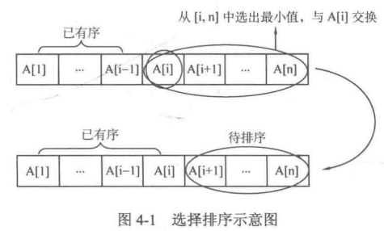
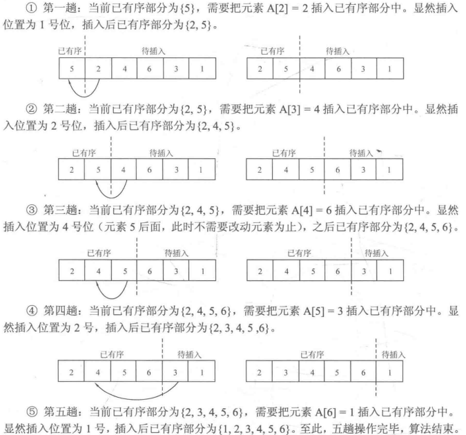
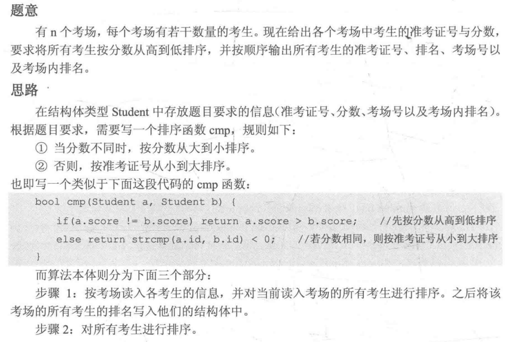

#cpp 2022/7/23
### 4.1.1 选择排序
下面介绍的是最常用的**简单选择排序**。

如上图所示，简单选择排序是指，对一个序列A中的元素A[1]~A[n]，令i从1到n枚举，进行n趟操作，每趟从待排序部分[i, n]中选择最小的元素，令其与待排序部分的第一个元素A[i]进行交换，这样元素A[i]就会与当前有序区间[1, i-1]形成新的有序区间[1, i]。于是n趟操作后，所有元素就会是有序的。

算法实现逻辑：总共需要进行n趟操作(1≤i≤n)，每趟操作选出待排序部分[i, n]中最小的元素，令其与A[i]交换。因此总复杂度是O(n^2)
```cpp
#include <iostream>
using namespace std;
void SelectSort(int *a, const int n);
//选择排序 
int main()
{
	int a[] = {16, 5, 6, 4, 2, 3, 1, 7, 9, 8};
	SelectSort(a, 10);
	for(int *p = a; p != a+10; ++p)
		cout << *p << " ";
	cout << endl;
	return 0;
}

void SelectSort(int *a, const int n)
{
	for(int i=0; i < n-1; ++i){
		int min = i;
		for(int j=i+1; j < n; ++j){
			if(a[j] < a[min])
				min = j;
		}
		int tmp = a[i];
		a[i] = a[min];
		a[min] = tmp;
	}	
}
```
### 4.1.2 插入排序
直接插入排序是指，对序列A的n个元素A[1]~A[n]，令i从2到n枚举，进行n-1趟操作。假设某一趟时，序列A的前i-1个元素A[1]~A[i-1]已经有序，而范围[i, n]还未有序，那么该趟从范围从范围[1, i-1]中寻找某个位置j，使得将A[i]插入位置j后(此时A[j]~A[i-1]会后移一位至A[j+1]~A[i])，范围[1,, i]有序，
- 假设现在有一个序列A[1~6]={5,2,4,6,3,1}，共有六个元素，因此需要进行6-1=5趟操作，用以分别将2、4、6、3、1插入初始已有序部分{5}中。

- 插入排序是将插入元素一个个插入初始已有序部分中的过程，而插入位置的选择遵循使插入后仍然保持有序的原则，具体做法一般使从后往前枚举已有序部分来确定插入位置。
```cpp
#include <iostream>
using namespace std;
void InsertSort(int *a, const int n);

int main()
{
	int a[] = {4, 5, 6, 2, 3, 7, 8, 9, 0};
	int len = sizeof(a) / sizeof(int);
	InsertSort(a, len);
	for(size_t i=0; i != len; ++i)
		cout << a[i] << " ";
	cout << endl;
	return 0;
}

void InsertSort(int *a, const int n){
	int i, j;
	for(i=1; i<n; ++i){
		int tmp = a[i];
		j=i;
		while(j > 0 && a[j-1] > tmp){
			a[j] = a[j-1];
			--j;
		}
		a[j] = tmp;	//插入位置为j 
	}
} 
```
### 4.1.3 sort函数的应用
1. 如何使用`sort()`排序
sort函数的使用必须加上头文件`#include <algorithm>`和`using namespace std;`，其使用的方式如下：
`sort(首元素地址必填,尾元素地址的下一个地址必填,比较函数选填);`
如果不写比较函数，则默认对前面给出的区间进行递增排序。
```cpp
#include <iostream>
#include <algorithm>
using namespace std;

int main()
{
	int a[] = {45, 21, 5, 8, 10, 6, 4, 3, 9, 47};
	int size = sizeof(a) / sizeof(int);
	for(int i=0; i != size; ++i)
		cout << a[i] << " ";
	cout << endl;
	
	sort(a, a+size);
	for(int *p=a; p != a+size; ++p)
		cout << *p << " ";
	cout << endl;

	return 0;
}
```
2. 如何实现比较函数cmp
下面介绍对基本数据类型，结构体类型，STL容器进行自定义规则排序时cmp的写法。

(1) 基本数据类型数组的排序
若比较函数不填，则默认按照从小到大的顺序排序。
如果想要从大到小来排序，则要使用比较函数cmp来“告诉”sort何时要交换元素(让元素的大小比较关系反过来)。
```cpp
bool compare(const int &a, const int &b)
{
	return a > b;	//可以理解为当 a > b 时把a放在b前面 
}

sort(a, a+size, compare);
for(int *p=a; p != a+size; ++p)
		cout << *p << " ";
cout << endl;
```
(2) 结构体数组的排序
```cpp
struct score{
	int x, y;
}ssd[4];

bool cmp(score &a, score &b){
	//如果x相等，按照y从小到大排序，否则按照x从大到小排序 
	if(a.x != b.x)	return a.x > b.x;
	else			return a.y < b.y;
}
```
1. 例：学生有姓名、准考证号、分数、排名等信息。这些信息在排序过程中一般都会用到，因此为了方便编写代码，常常将它们存至一个结构体中，然后用结构体数组来表示多个个体。
2. cmp函数的编写
	1. 如果两个学生分数不相同，那么分数高的排名在前面。
	2. 否则，将姓名字典序小的排在前面。
>strcmp()函数是头文件`cstring`下用来比较两个char型数组的字典序大小的。其中strcmp(str1, str2)当str1的字典序小于str2时返回一个负数，相等时返回0，大于时返回一个正数。

3. 排名的实现
排名规则一般是：**分数不同排名不同，分数相同的排名相同但占用一个排位**。例如有五个学生的分数分别为90、88、88、88、86，那么这五个学生的排名分别为1、2、2、2、5.
- 先将数组第一个个体(假设数组下标从0开始)的排名记为1，然后遍历剩余个体：如果当前个体的分数等于上一个个体的分数，那么当前个体的跑排名等于上一个个体的排名；否则，当前个体的排名等于**数组下标加1**。
```cpp
struct Studen{
	char name[10]; //姓名
	char id[10];   //准考证号
	int score;     //分数
	int r;         //排名
}stu[10000];

// cmp函数
bool cmp(const Student &a, const Student &b){
	if(a.score != b.score) return a.score > b.score;
	else return strcmp(a.name, b.name) < 0;
}

//排名的实现
stu[0].r = 1;
for(int i=1; i<n; ++i){
	if(stu[i].score == stu[i-1])
		stu[i].r = stu[i-1].r;
	else
		stu[i].r = i + 1;
}
```
(3) 容器的排序
在STL标准容器中，只有`vector`, `string`, `deque` 是可以使用`sort` 的。像`set`， `map` 这种容器元素本身有序，故不允许使用sort排序。

```cpp
#include <iostream>
#include <algorithm>
#include <vector>
#include <string>
using namespace std;

bool compare(const int &a, const int &b)
{
	return a > b;	//可以理解为当 a > b 时把a放在b前面 
}

struct score{
	int x, y;
}ssd[4];

bool cmp(score &a, score &b){
	//如果x相等，按照y从小到大排序，否则按照x从大到小排序 
	if(a.x != b.x)	return a.x > b.x;
	else			return a.y < b.y;
}

bool cmp2(const string &s1, const string &s2){
	return s1.size() < s2.size();
}

int main()
{
	int a[] = {45, 21, 5, 8, 10, 6, 4, 3, 9, 47};
	int size = sizeof(a) / sizeof(int);
	for(int i=0; i != size; ++i)
		cout << a[i] << " ";
	cout << endl;
	
	sort(a, a+size);
	for(int *p=a; p != a+size; ++p)
		cout << *p << " ";
	cout << endl;
	
	sort(a, a+size, compare);
	for(int *p=a; p != a+size; ++p)
		cout << *p << " ";
	cout << endl;
	
	// 结构体排序 
	ssd[0].x = 2;	//{2, 2}
	ssd[0].y = 2;
	ssd[1].x = 1;	//{1, 3}
	ssd[1].y = 3;
	ssd[2].x = 3;	//{3, 1}
	ssd[2].y = 1;
	ssd[3].x = 2;	//{2, 3}
	ssd[3].y = 3;
	
	sort(ssd, ssd+4, cmp);
	for(int i=0; i<4; ++i){
		cout << ssd[i].x << " " << ssd[i].y << endl;
	}
	//returns {3, 1} {2, 2}, {2, 3} {1, 3}
	
	//vector容器排序
	vector<int> ivec;
	ivec.push_back(3);
	ivec.push_back(1);
	ivec.push_back(2);
	sort(ivec.begin(), ivec.end(), compare);
	for(int i=0; i<3; ++i)
		cout << ivec[i] << " ";
	cout << endl;	// 3 2 1
	
	//string排序
	string str[3] = {"bbb", "cc", "aaa"};
	sort(str, str+3);	//将string型数组按字典序从小到大输出
	for(int i=0; i<3; ++i)
		cout << str[i] << " ";
	cout << endl;		// aaa bbb cc
	
	//按字符串长度从小到大排序
	sort(str, str+3, cmp2);
	for(int i=0; i<3; ++i)
		cout << str[i] << " ";
	cout << endl;		// cc aaa bbb
	return 0;
}
```


### PAT A1025 PAT Ranking



```cpp
#include <iostream>
#include <string>
#include <algorithm>
using namespace std;

struct Student{
	string id;	// 准考证 
	int score;	// 分数 
	int location_number;	// 考场号 
	int local_rank;	// 考场内排名
}stu[1000];

bool cmp(const Student &a, const Student &b){
	// 分数不同按照分数排名，相同则准考证小者靠前 
	if(a.score != b.score)	return a.score > b.score;
	else return a.id < b.id;
}

int main()
{
	int n, k, num=0;	//num为考生总数
	cin >> n;			//n为考场数
	for(int i=1; i<=n; ++i){
		cin >> k;		//k为该考场内人数
		for(int j=0; j<k; ++j){
			cin >> stu[num].id >> stu[num].score;
			stu[num].location_number = i;	//该考生的考场号为i
			++num;		//总考生数加1 
		}
		sort(stu + num -k, stu + num, cmp);	//将该考场的考生排序
		stu[num-k].local_rank = 1;			//该考场第1名的local_rank记为1
		for(int j=num-k+1; j<num; ++j){		//对该考场剩余的学生
			if(stu[j].score == stu[j-1].score){	//对考场剩余的考生 
				//local_rank也相同 
				stu[j].local_rank = stu[j-1].local_rank;	
			}else{
				//如果与前一位考生不同分，local_rank为该考生前的人数 
				stu[j].local_rank = j + 1 - (num - k);
			}
		} 
	}
	cout << num << endl;		//输出总考生数
	sort(stu, stu+num, cmp);	//将所有考生排序
	int r=1;
	for(int i=0; i<num; ++i){
		if(i > 0 && stu[i].score != stu[i-1].score){
			r = i + 1;			//当前考生与上一个考生分数不同时，让r更新为人数+1 
		}
		cout << stu[i].id << " ";
		cout << r << " " << stu[i].location_number << " " << stu[i].local_rank << endl;
	}
	return 0;
}
```