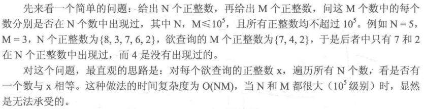

#cpp 2022/7/27
## 4.2.1 散列(hash)的定义与整数散列



不妨用空间换时间，即设定一个bool型数组hashTable[100010]，其中`hashTable==true`表示正整数x在N个正整数中出现过，false表示没有出现过。这样就可以在一开始读入N个正整数时就进行预处理。于是，对M个欲查询的数，就能直接通过hashTable数组判断出每个数是否出现过，这种做法的时间复杂度为`O(N+M)`。

```cpp
#include <iostream>
using namespace std;
bool hashTable[10010] = {false};
int main()
{
	int n, m, x;
	cout << "请输入n、m的值（个数）：" ; 
	cin >> n >> m;
	cout << "请输入n个数："; 
	for(int i=0; i<n; ++i){
		cin >> x;
		hashTable[x] = true;
	}
	cout << "请输入m个数：";
	for(int i=0; i<m; ++i){
		cin >> x;
		if(hashTable[x])	cout << "YES" << endl;
		else			cout << "NO" << endl; 
	}
	return 0;
}
```

同样，如果题目要求M个欲查询数种在N个数中出现的次数，那么可以将hashTable数组替换为int型，然后在输入N个数时进行预处理，即当数的数为x时，就令hashTable[x]++，这样就可以用`O(N+M)`的时间复杂度输出每个欲查询的数出现的次数。

```cpp
#include <iostream>
using namespace std;
//bool hashTable[10010] = {false};
int hashTable[10010] = {0};

int main()
{
	int n, m, x;
	cout << "请输入n、m的值（个数）：" ; 
	cin >> n >> m;
	cout << "请输入n个数："; 
	for(int i=0; i<n; ++i){
		cin >> x;
		++hashTable[x];
	}
	cout << "请输入m个数：";
	for(int i=0; i<m; ++i){
		cin >> x;
//		if(hashTable[x])	cout << "YES" << endl;
//		else			cout << "NO" << endl;
		cout << hashTable[x] << endl;
	}
	return 0;
}
```

上面的两个问题都有一个特点，那就是直接把输入的数作为数组的下标来对这个数的性质进行统计(这种做法非常实用)。这是一个很好的用空间换时间的策略，因为它将查询的复杂度降到了`O(1)`级别。

但是当输入超过10^9大小的整数，或者设置是一个字符串(例如"Hello world")时，就不能直接将它们作为数组小标了。

**散列(hash)：将元素通过一个函数转换为一个整数，使得该整数可以尽量唯一地代表这个元素**。这个转换函数称为**散列函数**H。`key→H(key)`。

### 4.2.2 字符串hash初步

如果key不是整数，应当如何设计散列函数？
例：**如何将一个二维整点P的坐标映射为一个整数，使得整点P可以由该整数唯一地代表**。

为了讨论方便，先假设字符串均由大写字母A~Z构成。在这个基础上，不妨把A~Z视为0~25，这样就把26个大写字母对应到了二十六进制中。紧着按照将二十六进制转换为十进制的思路，由进制转换的结论可知，在进制转换过程中，得到的十进制肯定是唯一的，由此便实现将字符串映射为整数的需求(注意：转换成的整数最大为26^len - 1，其中len为字符串长度)。代码如下：

```cpp
int hashFunc(string s, const int len){ //hash函数，将字符串s转换为整数
	int id = 0;
	for(int i=0, i<len; ++i)
		id = id * 26 + (s[i] - 'A')
	return id;
}
```

如果字符串中出现了小写字母，那么可以把A~Z作为0~25，而把0~25，而把a~z作为26~51，这样就完成 五十二进制转换为十进制的问题，做法也是相同的：

```cpp
int hashFunc(string s, const int len){
	int id = 0;
	for(int i=0; i<len; ++i){
		if(s[i] >= 'A' && s[i] <= 'Z')
			id = id * 52 + (s[i] - 'A')
		else if(s[i] >= 'a' && a[i] <= 'z')
			id = id * 52 + (s[i] - 'a') + 26;
	}
	return id;
}
```

如果出现了数字，一般有两种处理方法：
1. 按照小写字母的处理方法，增大进制至62
2. 如果保证在字符串末尾是确定个数的数字，那么就可以把前面英文字母的部分按上面的思路转换成整数，再将末尾的数字直接拼接上去。例如对由三个字符加一位数字组成的字符串”BCD4“来说，就可以先将前面的”BCD“转换为整数731，然后直接拼接上末尾的4变为7314。下面的代码提下了这个例子：

```cpp
int hashFunc(string s, const int len){
	int id = 0;
	for(int i=0; i<len-1; ++i)
		id = id * 26 + (s[i] - 'A');
	id = id * 10 + (s[len-1] - '0');
	return id;
}
```

例题：给出N个字符串(由恰好三位大写字母组成)，再给出M个查询字符串，问每个查询字符串在N个字符串中出现的次数。

```cpp
#include <iostream>
#include <string>
using namespace std;

int hashFunc(const string &s, const int len){
	int id = 0;
	for(int i=0; i<len; ++i)
		id = id * 26 + (s[i] - 'A');
	return id;
}

int hashTable[26 * 26 * 26 +10];

int main()
{
//	string s("BCD");
//	cout << hashFunc(s, 3);	//731
	int n, m;
	cout << "请输入N个字符串，M个查询字符串：" << endl;
	cin >> n >> m;
	for(int i=0; i<n; ++i){
		string s;
		cin >> s;
		int id = hashFunc(s, 3);
		++hashTable[id];
	}
	
	for(int j=0; j<m; ++j){
		string s2;
		cin >> s2;
		int id2 = hashFunc(s2, 3);
		cout << hashTable[id2] << endl;
	}
	return 0;
}
```