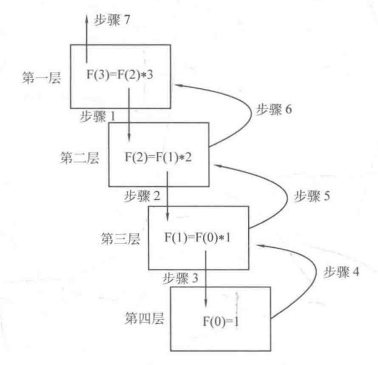
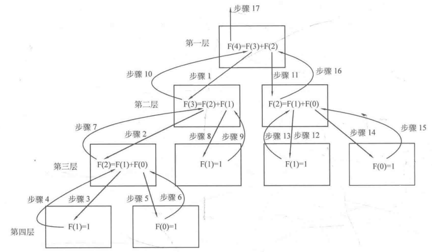
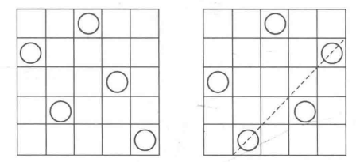

#cpp 2022/7/30
### 4.3.1 分治

分治(divide and conquer)的全称为“分而治之”。**分治法将原问题划分成若干个规模较小而结构域原问题相同或相似的子问题，然后分别解决这些子问题，最后合并子问题的解，即可得到为原问题的解**。上述定义体现出分治法的三个步骤：
1. 分解：将原问题分解为若干和原问题拥有相同或相似结构的子问题。
2. 解决：递归求解所有子问题。如果存在子问题的规模小到可以直接解决，就直接解决它。
3. 合并：将子问题的解合并为原问题的解。

分治法**分解出的子问题应当是相互独立，没有交叉的**。

从严格定义上讲，一般把子问题个数为1的情况称为**减治**(decrease and conquer)，而把子问题个数大于1的情况称为分支。分治法作为一种算法思想，**既可以使用递归的手段实现，也可以通过非递归的手段实现**。

### 4.3.2 递归

递归就在于反复调用自身函数，但是每次把问题范围缩小，直到范围小到可以直接得到边界数据的结果，然后再在返回的路上求出对应的解。从这点上看，递归很适合用来实现分治思想。递归的逻辑中一般有两个重要的概念：
1. **递归边界**
2. **递归式**(或称**递归调用**)

**递归式是将原问题分解为若干个子问题的手段，而递归边界则是分解的尽头**。

一个经典的例子：**使用递归求解n的阶乘**。
n!的计算式：`n!=1*2*3*...n` ，这个式子写成地推的形式就是`n!=n*(n-1)!` ，把规模为n的问题转换为为求解规模为n-1的问题。由于`0!=1`，所以递归边界为`n=0`。



```cpp
#include <iostream>
int F(n){
	if(n == 0) //递归边界
		return 1;
	else
		return n * F(n-1); //递归调用
}
int main()
{
	int n;
	cin >> n;
	cout << F(n) << endl;
	return 0;
}
```

例子：**求Fibonacci数列的第n项**。



```cpp
#include <iostream>
using namespace std;
int F(int n){
	if(n==0 || n==1) //递归边界
		return 1;
	else
		return F(n-1) + F(n-2); //递归调用
}
int main()
{
	int n;
	scanf("%d", &n);
	printf("%d\n", F(n));
	return 0;
}
```

#### 全排列(Full Permutation)

一般把1~n这n个整数按某个顺序摆放的结果称为这n个整数的一个排列，而全排列指这n个整数形成的所有排列。例如对1、2、3这三个整数来说，(1,2,3), (1,3,2), (2,1,3), (2,3,1), (3,1,2), (3,2,1)就是1~3的全排列。现在需要实现按字典序从小到大的顺序输出1~n的全排列，其中(a1, a2, ..., an)的字典序小于(b1,b2,...,bn)是指存在一个i，使得a1=b1, a2=b2, ..., `ai<bi` 成立。因此上面n=3的例子就是按字典序从小到达的顺序给出的。

从递归的角度去考虑，如果把问题描述成“输出1~n个整数的全排列”，那么它就可以被分为若干个子问题：“输出以1开头的全排列”，“输出以2开头的全排列”……“输出以n开头的全排列”。不妨设定一个数组P，用来存放当前的排列；再设定一个散列数组hashTable，其中hashTable[x]当整数x已经在数组P中时为true。

现在按顺序往P的第1为到第n位中填入数字。不妨假设当前已经填好了P[1]~P[index-1]，正准备填P[index]。显然需要枚举1~n，如果当前枚举的数字x还没有在P[1]~P[index-1]中(即hashTable[x] == false)，那么就把它填入P[index]，同时将hashTable[x]置为true，然后去处理P的第index+1位(即进行递归)；而当递归完成时，再将hashTable[x]还原为false，以便让P[index]填下一个数字。

递归的边界，当index达到n+1时，说明P的第1~n位都已经填好了，此时可以把数组P输出，表示生成了一个排列，然后直接return即可。

```cpp
#include <iostream>
using namespace std;

int F(int n){	//n! 
	if(n == 0)	return 1;	
	else		return F(n-1) * n;
}

int Fibo(int n){
	if(n == 1 || n == 0)	return 1;
	else					return Fibo(n-1) + Fibo(n-2);
}

const int maxn = 11;
int n, p[maxn];
bool hashTable[maxn] = {false};
void generateP(int index){
	if(index == n+1){
		for(int i=1; i<=n; ++i)
			cout << p[i] << " ";
		cout << endl;
		return ;
	}
	for(int x=1; x<=n; ++x){	//枚举1~n，试图将x填入p[index] 
		if(hashTable[x] == false){	//如果x不在p[0]~p[index-1]中 
			p[index] = x;		//令p的第index位为x，即把x加入当前排列 
			hashTable[x] = true;//记x已在p中 
			generateP(index + 1);//处理排列中的第index+1号位，一直递归把p[index]=x的排列全部包含 
			hashTable[x] = false;//已处理完p[index]为x的子问题，还原状态 
		}
	}
}

int main()
{
	n = 3;	// 欲输出1~3的全排列
	generateP(1); //从p[1]开始填 
	return 0;
}
```

n皇后问题。在一个n×n的国际象棋棋盘上放置n个皇后，使得这n个皇后两两均不在同一行、同一列、同一条对角线上，求合法的方案数？下图为n=5的情况，其中左图合法，右图由于有两个皇后在同一条对角线上不合法。



如果采用组合数的方式来枚举每一种情况(即从n^2个位置选择n个位置)，那么将需要`Cn×n ^ n` 的枚举量，当n=8时，就是54502232次。

考虑到每行只能放置一个皇后、每列也只能放置一个皇后，那么如果把n列的皇后所在的行号一次写出，就会是1~n的所有排列，查看每个排列对应的放置方案是否合法，统计其中合法的方案即可。由于总共有n!个排列，因此当n=8时只需要40320次枚举。

于是可以在全排列的代码基础上进行求解。由于当到达递归边界时表示生成了一个排列，所以需要在其内部判断是否为合法方案，即遍历每两个皇后，判断它们是否在同一条对角线上，如不是，则累计计数量count即可。当n=8时，count最后等于92：

```cpp
#include <iostream>
#include <cmath>
using namespace std;

const int maxn = 10001;
int n, p[maxn];//n为棋盘大小
bool hashTable[maxn] = {false};
int count = 0;

void generateN(int index){
	if(index == n+1){ //决策边界
		bool flag = true;
		for(int i=1; i<=n; ++i){
			for(int j=i+1; j<=n; ++j){
				if(abs(i - j) == (p[i] - p[j]))
					flag = false;
			}
		}
		if(flag) ++count;
		return ;
	}
	for(int x=1; x<=n; ++x){
		if(hashTable[x] == false)
			p[index] = x;
			hashTable[x] = true;
			generateTable[index + 1];
			hashTable[x] = false;
	}
}

int main()
{
	n = 8;//棋盘大小为8时
	generateN(1);//从1开始
	cout << count << endl; //输出合法方案数
}
```

这样枚举所有情况，然后判断每一种情况是否合法的做法是非常朴素的(因此一把把不适用优化算法，直接用朴素算法来解决问题的做法称为**暴力法**)。事实上，通过思考可以 发现，当已经放置了一部分皇后时，可能剩余的皇后无论怎样放置都已经不可能合法，此时就没必要往下递归了，直接返回上层即可，这样可以减少很多计算量。

一般来说，如果在到达递归边界前的某层，由于一些事实导致已经不需要往任何一个子问题递归，就可以直接返回上一层。一般把这种做法称为**回溯法**。

```cpp
#include <iostream>
#include <cmath>
using namespace std;

int count = 0;	//计数合法方案
const int maxn = 10001;	//hash表最大长度
int n, p[maxn];	//n为棋盘大小，p[index]表示下标index列皇后所在行号 
bool hashTable[maxn] = {false};	//hash表 
void generateN2(int index){
	if(index == n+1){	//递归边界，生成一个合法方案 
		++count;	//能到达这里的一定是合法的 
		return ;
	}
	for(int x=1; x<=n; ++x){
		if(hashTable[x] == false){
			bool flag = true;
			for(int pre=1; pre<index; ++pre){
				if(abs(pre-index) == abs(p[pre] - x)){
					flag = false;
					break;	
				}
			}
			if(flag){
				p[index] = x;
				hashTable[x] = true;
				generateN2(index+1);
				hashTable[x] = false;
			}
		}
	}
}

int main()
{
	n = 8;
	generateN2(1);
	cout << count << endl; 
	return 0;
}
```