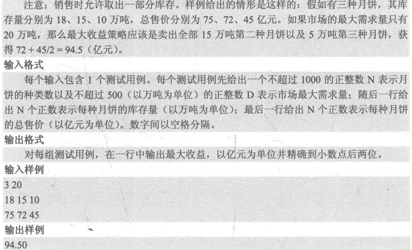
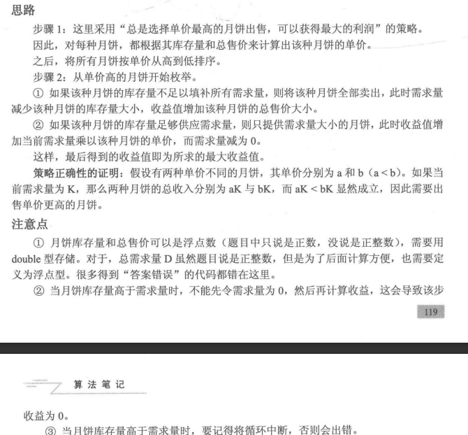
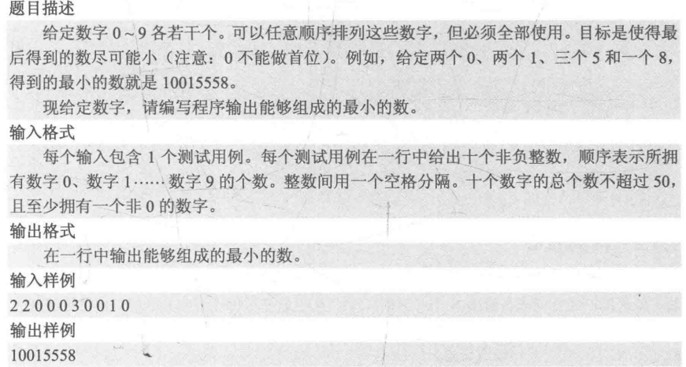
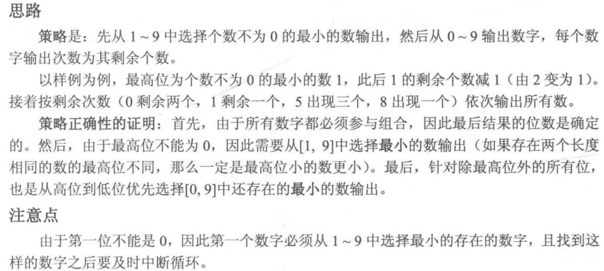
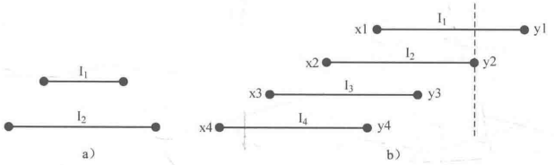

#cpp 2022/7/31

### 4.4.1 简单贪心

贪心法是求解一类最优化问题的方法，它总是考虑在当前状态下局部最优(或较优)的策略，来使全局的结果达到最优(或较优)。严谨使用贪心法来求解最优化问题需要对采取的策略进行证明。一般思路是使用反证法及数学归纳法，即假设策略不能导致最优解，然后通过一系列推到来得到矛盾，以此证明策略是最优的，最后用数学归纳法保证全局最优。贪心的证明往往比贪心本身更难，因此一般来说，**如果在想到某个似乎可行的策略，并且自己无法举出反例，那么就实现它**。

#### PAT B1020 月饼





```cpp
#include <cstdio>
#include <algorithm>
using namespace std;

struct mooncake{
	double store;	//库存量
	double sell;	//总售价
	double price;	//单价 
} cake[1001];

bool cmp(const mooncake &a, const mooncake &b){
	return a.price > b.price;	//按单价从小到达排序 
}

int main()
{
	int n;	//月饼品种
	double D;	//需求量
	scanf("%d%lf", &n, &D);
	for(int i=0; i<n; ++i)
		scanf("%lf", &cake[i].store);
	for(int i=0; i<n; ++i){
		scanf("%lf", &cake[i].sell);
		cake[i].price = cake[i].sell / cake[i].store;	//计算单价 
	}
	
	sort(cake, cake+n, cmp);	//按单价从高到低排序 
	
	double ans = 0;	//收益
	for(int i=0; i<n; ++i){	
		if(cake[i].store <= D){	//如果需求量高于月饼库存量 
			D -= cake[i].store;	 //第i种月饼全部卖出 
			ans += cake[i].sell;
		}else{					//如果月饼库存量高于需求量 
			ans += cake[i].price * D;	//只卖出剩余需求量的月饼
			break; 
		}
	} 
	printf("%.2f\n", ans);
	return 0;
}
```

#### PAT B1023 组个最小数





```cpp
#include <iostream>
using namespace std;
int main()
{
	int count[10];			//记录数字0~9的个数 
	for(int i=0; i<10; ++i)	
		scanf("%d", &count[i]);
	for(int i=1; i<10; ++i){
		if(count[i] > 0){	//从1~9中选择count不为0的最小的数字 
			printf("%d", i);
			--count[i];
			break;			//找到一个之后就中断 
		}
	}
	for(int i=0; i<10; ++i){	//从0~9输出对应个数的数字 
		while(count[i] > 0){
			printf("%d", i);
			--count[i];
		}
	}
	return 0;
}
```

### 4.4.2 区间贪心

**区间不相交问题：给出N个开区间(x, y)，从中选择尽可能多的开区间，使得这些开区间两两没有交集**。例如对开区间(1, 3), (2, 4), (3, 5), (6, 7)来说，可以选出最多三个区间(1, 3), (3, 5), (6, 7)，它们相互没有交集。

首先考虑最简单的情况，如果开区间I1被开区间I2包含，如下图a，那么显然选择I1是最好的选择，可以有更大的空间去容纳其它开区间。



接下来把所有开区间按左端点x从大到小排序，如果去除掉区间包含的情况，那么一定有`y1<y2<...<yn` 成立，如上图b所示。现在考虑应当如何选择区间。I1右边有一段是一定不会和其它区间重叠的，如果把它取代哦，那么I1左边剩余部分就会被I2包含，应当选择I。.因此对这种情况，**总是选择左端点最大的区间**。

```cpp
#include <iostream>
#include <algorithm>
using namespace std;
const int maxn = 101;
struct interval{
	int x;	//开区间左右端点 
	int y;
} I[maxn];

bool cmp2(const interval &a, const interval &b){
	//如果x不同，按左端点从大到小排序；否则，按照右端点从小到大排序 
	return (a.x != b.x) ? (a.x > b.x) : (a.y < b.y);
}

int main()
{
	int n;
	while(scanf("%d", &n), n != 0){
		for(int i=0; i<n; ++i){
			scanf("%d%d", &I[i].x, &I[i].y);
		}
		sort(I, I+n, cmp2);
		// ans记录不相交区间个数，lastX记录上一个被选中区间的左端点
		int ans = 1, lastX = I[0].x;
		for(int i=1; i<n; ++i){
			if(I[i].y <= lastX){
				lastX = I[i].x;
				++ans;
			}
		}
		printf("%d\n", ans);
	}
	return 0;
}
```

与这个问题类似的问题是区间选点问题：**给出N个区间`[x, y]` ，求最少需要确定多少个点，才能使每个闭区间中都至少存在一个点**。例如对闭区间`[1,4], [2,6], [5,7]` 来说，需要两个点(例如3、5)才能保证每个闭区间都有至少一个点。

事实上，这个问题和区间不相交问题的策略是一致的。首先，如果闭区间I1被闭区间I2包含，那么在I1中取点可以保证这个点一定在I2内。接着把所有区间按左端点从大到小排序，去掉区间包含的情况，就可以得到上图b。显然，由于每个闭区间都需要存在一个点，因此对左端点最大的区间I1来说，取左端点可以尽可能地覆盖其它区间！区间选点问题地代码只需要把区间不相交问题代码中的`I[i].y<=lstX` 改为 `I[i].y<lastX` 即可。

贪心算法是用来解决一类最优化问题，并希望**由局部最优解策略来推得全局最优结果**的算法思想。贪心算法适用的问题一定满足**最优子结构**性质，即一个问题的最优解可以由它的子问题的最优解有效地构造出来。
